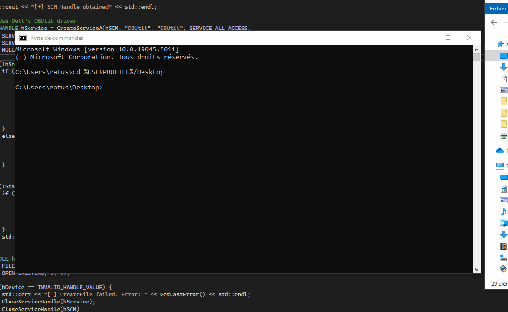
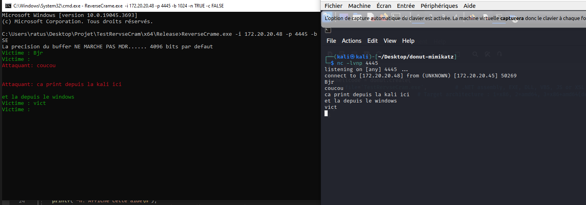
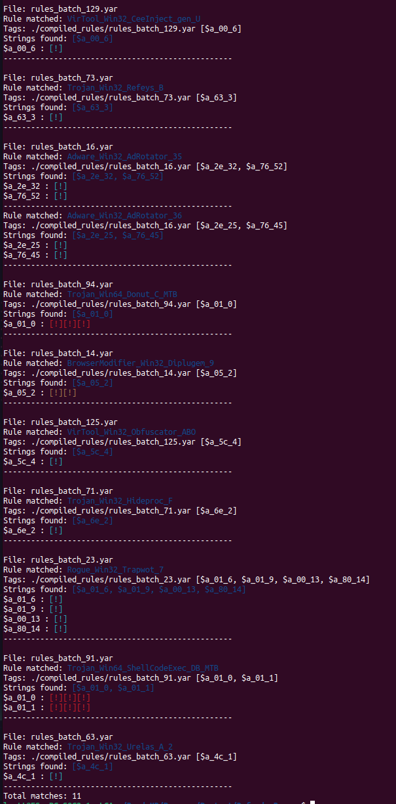

# Salle-Des-Trophees
C'est un repo uniqument creer pour montrer mes capacités et clairement flex. Rien de plus, rien de moins

## Avertissement

Ces projets sont destinés uniquement à des fins éducatives dans un cadre éthique. **L'utilisation de ces techniques dans un environnement non autorisé est illégale et non éthique.** Assurez-vous d'avoir l'autorisation avant de tester quoi que ce soit.

Ces projest cités ont été réalisés dans un cadre légal et totalement ethique.

## Projets

1. **Exploitation du Driver pour passer d'un compte utilisateur à un compte système**  
   - Grâce au driver [`dbutil_2_3.sys`](https://www.dell.com/support/kbdoc/fr-fr/000186019/mise-a-jour-de-s%C3%A9curit%C3%A9-de-la-plate-forme-client-dell-suite-a-une-faille-de-s%C3%A9curit%C3%A9-de-controle-dacc%C3%A8s-insuffisant-dans-le-pilote-dell), il est possible de l'utiliser pour lire la mémoire avec les droits d'autorité kernel.  
   - En utilisant les bons ioctl, on peut lire la mémoire du processus actuel.  
   - Voler le token Système (l'autorité la plus haute visible).  
   - Appliquer ce token à notre nouveau processus.

   

2. **Reverse Shell**  
   - Codé en C++, il permet de se connecter à un serveur distant.  
   - Dans un souci de démonstration, j'ai affiché les commandes exécutées sur la machine cible.  
   - Il est possible de l'utiliser pour exécuter des commandes sur la machine cible.

   

3. **Décompilation de Windows Defender et extraction des règles YARA**  
   - C'était un gros morceau, j'ai décompilé Windows Defender pour comprendre son fonctionnement.  
   - Il faut d'abord utiliser l'exploitation kernel précédente pour dumper le processus de Defender.  
   - Ensuite, en recherchant la signature des règles YARA, on peut les extraire.  
   - Enfin, je les ai de nouveau compilées pour pouvoir les utiliser afin de vérifier si mes payloads sont détectés par Defender.  
   (Démonstration avec le PE [donut](https://github.com/TheWover/donut), le générateur de shellcode)

   

4. **Ransomware avec exfiltration de données**  
   - Codé en C#, c'est l'un de mes premiers projets offensifs.  
   - Il a la capacité de bypasser les EDR (basé sur la façon dont les EDR bloquent les ransomwares).  
   - Une clé 32 bits est générée et envoyée à l'attaquant.  
   - La machine victime chiffre les données (ici, uniquement `C:/Users/user`) avec cette clé.  
   - Les fichiers sont exfiltrés vers un C2.  
   - Les fichiers originaux sont supprimés et l'emplacement disque est rempli de nullbytes.  
   - Enfin, une demande de rançon est faite via un bloc-note.

   

5. **Bypass de l'EDR Defender : Pack de Shellcode et PuTTY**  
   - C'est l'un des projets dont je suis le plus fier, plus d'un an et demi de recherche.  
   - L'objectif est de cacher un payload dans une PE officielle.  
   - Je confectionne mon shellcode et je décompile PuTTY ici.  
   - Grâce à la décompilation, je peux vraiment comprendre son fonctionnement.  
   - Je pack mon shellcode et répare le PE que je viens de modifier (obligatoire lorsqu'on modifie l'hexadécimal directement).  
   - Au moment de lancer la connexion, mon payload se lance, créant un socket et redirigeant les sorties, entrées et erreurs du `cmd.exe` vers la socket, qui est connectée à la machine attaquante.

   

